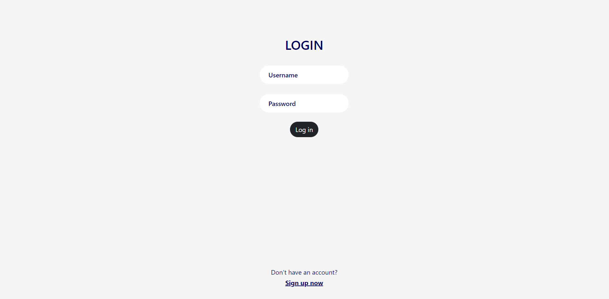
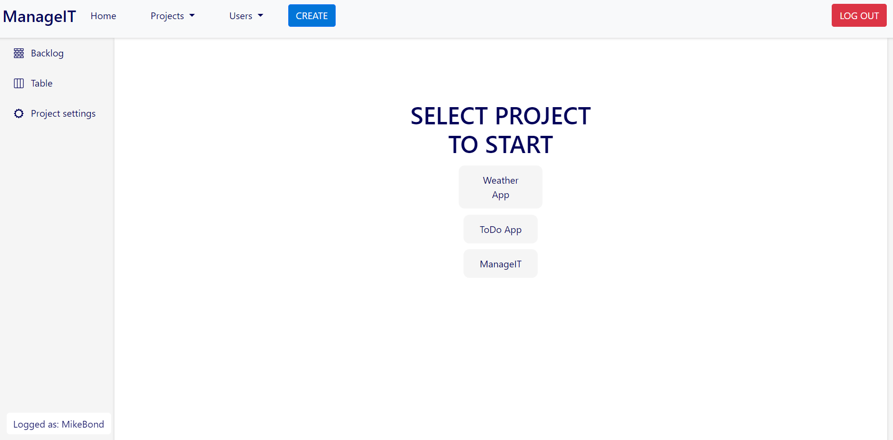
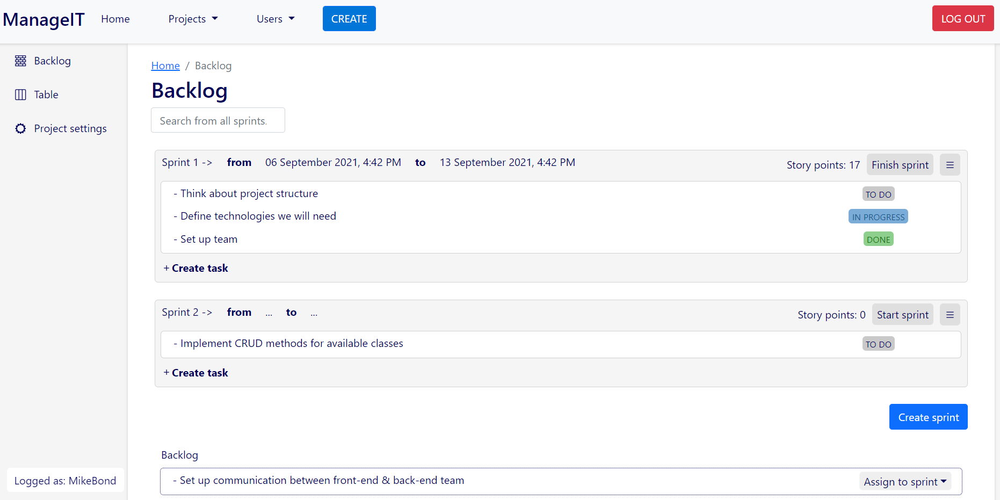
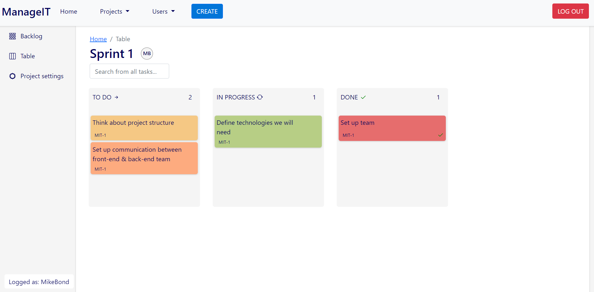
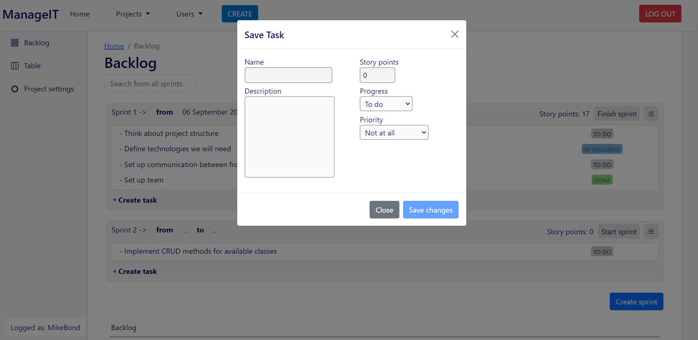

# ManageIT

Jira alike app to help with projects management

## TABLE OF CONTENTS

* [Screenshots from app](#screenshots-from-app)
* [Progress](#progress)
* [How to start](#how-to-start)
* [Technologies](#technologies)
* [Further help](#further-help)

## Screenshots from app 

 #### Login view

#### Home view

#### Backlog view

#### Table view

#### Form view

## Progress 

:heavy_check_mark::heavy_check_mark::heavy_check_mark::heavy_check_mark::heavy_check_mark::heavy_check_mark::heavy_check_mark::x::x::x: - 70%

## How to start 

 * First you have to make sure you run this(https://github.com/igor-on/manageit-demo) on your computer
 * To install all needed node_modules use the command `npm ci` on the command line from this application directory
 * Then run `ng serve` for a dev server. Navigate to `http://localhost:4200/` where the application will run

 ## Technologies 

#### This project was generated with [Angular CLI](https://github.com/angular/angular-cli) version 11.2.5.
 
## Further help

To get more help on the Angular CLI use `ng help` or go check out the [Angular CLI Overview and Command Reference](https://angular.io/cli) page.
